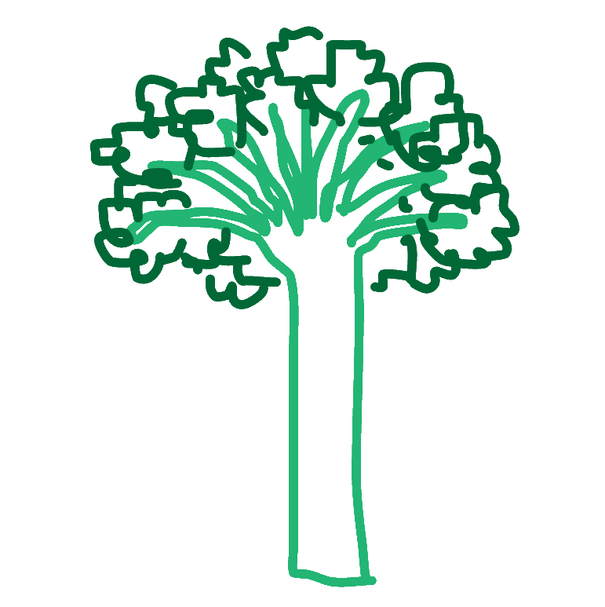

= Broccoli manager

 This application is a quick demo to introduce capabilities and syntax of TypeScript 

== Prerequisites

* TypeScript compiler
+
To install it run the following command in your terminal
+
----
npm install typescript --save-dev
----

== Run 

To run this application one will need to: 

. Compile main.ts to JavaScript:
+
----
tsc main.ts
----
+
. Open broccoli.html in the browser. Left click puts a broccoli on the screen and other clicks remove the nearest one.
